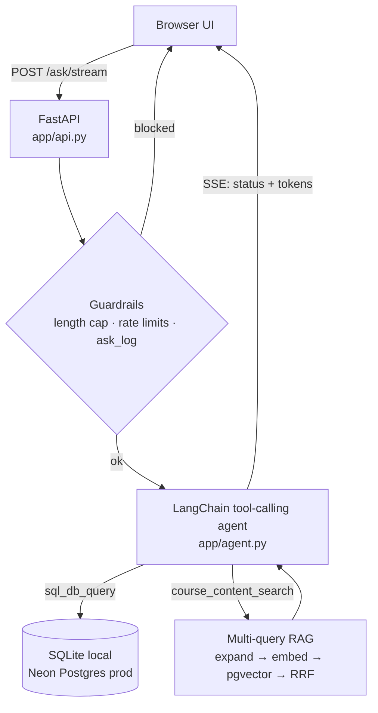

# Illini Course Copilot

**Ask plain-English questions about UIUC's course catalog and get answers backed by real SQL, not a guess.**

*Not affiliated with, endorsed by, or sponsored by the University of Illinois.*

I built a text-to-SQL agent over UIUC's public
[Course Explorer](https://courses.illinois.edu/cisdocs/explorer) data, put it
behind a FastAPI backend, and then did the part most demos skip: measured
whether the agent's own safety net (a Critic/Repair loop) actually helped.
It mostly didn't, and that turned out to be the most useful thing in the
project. See [What I learned](#what-i-learned).

Stack: Python · FastAPI · LangChain / LangGraph · SQLite + Neon Postgres +
pgvector · self-hosted embeddings · Server-Sent Events · Render.

---

## What it does

- **Answers from real data.** A tool-calling agent picks per question between
  direct SQL and semantic search over course descriptions. The full schema sits
  in the prompt, so a typical answer takes about 2 model calls, with no
  database-introspection round trip first.
- **Cites its sources.** Each answer ends with a footer naming the datasets it
  used and how fresh they are, built by parsing the SQL the agent actually ran
  (no extra model call).
- **Streams, with memory.** Answers arrive token by token over SSE with live
  status labels ("Running SQL…"). The server is stateless; the browser sends
  back the last few turns so "that course" resolves.
- **Wider than chat.** Prerequisites (parsed from free text), the academic
  calendar, grade trends, and schedule-conflict checks are all queryable.

## What I learned

Five things that happened in this project, not things I read about.

1. **A safety net can be a no-op, or a net negative.** With the full schema in
   the prompt, the base agent invented a column 0% of the time, so the Critic's
   schema check never fired. Its LLM "intent check" made things worse: it
   invented objections to correct queries and "repaired" them into wrong ones
   (result-match 92.3% → 84.6% on the first run). I demoted it to a repair
   verifier that can no longer veto a first-pass query.
2. **Test where the failure actually lives.** Where the loop had nothing to
   fix, I made the generator worse on purpose (terse schema, smaller model).
   There the loop earned its place: invented references 31% → 6%, execution
   success 69% → 100%.
3. **Rate limits are a design input.** The free Groq tier allows 8,000
   tokens/min and one agent step costs about 6,100. I compressed the system
   prompt and added a global daily cap that keys on nothing the client controls.
   Per-IP limits are only friction.
4. **"Works locally" is not "works in prod."** One SQL string had to run on
   SQLite and Postgres. A `%` inside a `LIKE` broke only on psycopg2, and a
   scraper "wall" only showed up against the live site.
5. **Log the why.** Every non-obvious choice, including the options I rejected,
   is in [`DECISIONS.md`](DECISIONS.md). It saved me from re-arguing things.

## Evals

24 questions with known-correct SQL, scored with the Critic/Repair loop off vs.
on, same model. The eval set has since grown to 29 questions; the numbers
below are from the 24-question run.

| config | metric | baseline | with loop |
|---|---|---|---|
| full schema, `gpt-oss-120b` | hallucinated references | 0% | 0% |
| full schema, `gpt-oss-120b` | result-match (loose) | 92.3% | 84.6% *(first run)* |
| terse schema, `gpt-4o-mini` | hallucinated references | 31% | 6% |
| terse schema, `gpt-4o-mini` | execution success | 69% | 100% |

**Caveats, stated up front.** These are single runs on a small set. The 84.6%
row is *before* the routing fixes that followed; the fixed version is
predicted, not yet re-measured (a Groq daily token cap cut the re-run short).
Methodology and every number: [`evals/RESULTS.md`](evals/RESULTS.md) and
[`evals/FINDINGS.md`](evals/FINDINGS.md).

## Architecture



The server is stateless. Two storage layers: the relational catalog (sections,
meetings, grade distributions, prerequisites, calendar) and a Postgres-only
vector table for semantic search. Opt-in: `SQL_PIPELINE=critic` routes `ask()`
through the Generator → Critic → Repair loop in `app/sql_pipeline/`.

## Engineering choices worth a look

| choice | why |
|---|---|
| One query text, two databases (`app/db.py`) | Nobody needs Postgres to develop; placeholders and upserts are translated |
| Self-hosted embeddings (`bge-small` via fastembed) | No API key, no rate limit, same vectors everywhere |
| Provider-agnostic LLM (Groq → OpenAI → Gemini) | Swapping providers is an env var, not a code change |
| Multi-query expansion + Reciprocal Rank Fusion | Wider recall than one embedding; enough material for a real summary |
| Read-only DB role for the SQL tool | A jailbreak still can't run DDL/DML |
| Global daily cap, per-IP limits, red-team pass | Budget backstop; findings in [`security_findings.md`](security_findings.md) |

## Run it

```bash
python -m venv .venv && source .venv/bin/activate   # Windows: .venv\Scripts\activate
pip install -r requirements.txt
python app/scraper.py --year 2026 --semester fall --subjects CS,STAT --fast
uvicorn app.api:app --reload                        # http://127.0.0.1:8000
```

Needs one LLM key in the environment (`GROQ_API_KEY`, `OPENAI_API_KEY`, or
`GEMINI_API_KEY`). Offline tests, no key needed:
`python -m evals.test_static_check` and `python -m evals.test_graph_routing`.

## Known limitations

- Cross-listed courses (CS 440 / ECE 448) are separate rows, not deduplicated.
- Enrollment status is a snapshot from the last sync, not live.
- Scraping runs by hand; the deployed app serves whatever was last loaded.
- The eval set is small (29 questions), so treat percentages as directional.
- Some upstream datasets are empty for new terms; the agent says so instead of
  inventing data.

## More

- [`docs/REFERENCE.md`](docs/REFERENCE.md): full reference (scraper flags, API surface, data model, guardrails, repo layout)
- [`DECISIONS.md`](DECISIONS.md): every decision and the alternatives I rejected
- [`DEPLOYMENT.md`](DEPLOYMENT.md): Render + Neon runbook
- [`docs/architecture.html`](docs/architecture.html): illustrated storage model and request path
- [`security_findings.md`](security_findings.md): red-team findings and hardening
