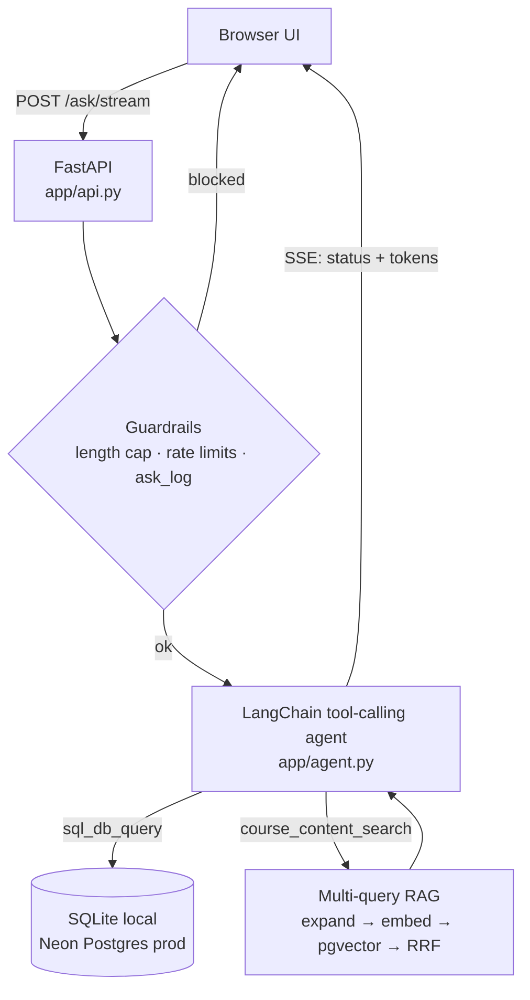

# Illini Course Copilot

**Ask plain-English questions about UIUC's course catalog and get answers backed by real SQL, not a guess.**

*Not affiliated with, endorsed by, or sponsored by the University of Illinois.*

I built a text-to-SQL agent over UIUC's public
[Course Explorer](https://courses.illinois.edu/cisdocs/explorer) data, put it
behind a FastAPI backend, and then did the part most demos skip: measured
whether the agent's own safety net (a Critic/Repair loop) actually helped.
It mostly didn't, and that turned out to be the most useful thing in the
project. See [What I learned](#what-i-learned).

Stack: Python · FastAPI · LangChain / LangGraph · SQLite + Neon Postgres +
pgvector · self-hosted embeddings · Server-Sent Events · Render.

---

## What it does

- **Answers from real data.** A tool-calling agent picks per question between
  direct SQL and semantic search over course descriptions. The full schema sits
  in the prompt, so a typical answer takes about 2 model calls, with no
  database-introspection round trip first.
- **Cites its sources.** Each answer ends with a footer naming the datasets it
  used and how fresh they are, built by parsing the SQL the agent actually ran
  (no extra model call).
- **Streams, with memory.** Answers arrive token by token over SSE with live
  status labels ("Running SQL…"). The server is stateless; the browser sends
  back the last few turns so "that course" resolves.
- **Wider than chat.** Prerequisites (parsed from free text), the academic
  calendar, grade trends, and schedule-conflict checks are all queryable.

## What I learned

Five things that happened in this project, not things I read about.

1. **A safety net can be a no-op, or a net negative.** With the full schema in
   the prompt, the base agent invented a column 0% of the time, so the Critic's
   schema check never fired. Its LLM "intent check" made things worse: it
   invented objections to correct queries and "repaired" them into wrong ones
   (result-match 92.3% → 84.6% on the first run). I demoted it to a repair
   verifier that can no longer veto a first-pass query.
2. **Test where the failure actually lives.** Where the loop had nothing to
   fix, I made the generator worse on purpose (terse schema, smaller model).
   There the loop earned its place: invented references 31% → 6%, execution
   success 69% → 100%.
3. **Rate limits are a design input.** The free Groq tier allows 8,000
   tokens/min, and the daily cap is per model. One agent step costs about
   6,100 tokens, so I compressed the prompt, added a global daily cap that keys
   on nothing the client controls, and started budgeting eval runs like money:
   a token counter, a smaller question set, and dropping an arm that could not
   fire. Because the cap is per model, a second model on the same key is a
   failover with its own budget.
4. **"Works locally" is not "works in prod."** One SQL string had to run on
   SQLite and Postgres. A `%` inside a `LIKE` broke only on psycopg2, and a
   scraper "wall" only showed up against the live site.
5. **Log the why.** Every non-obvious choice, including the options I rejected,
   is in [`DECISIONS.md`](DECISIONS.md). It saved me from re-arguing things.

## Evals

29 questions with known-correct SQL: in-scope, hallucination-bait, empty-data
and out-of-scope refusals. Each runs with the Critic/Repair loop off (baseline)
and on. I ran it on three open-weight models and two prompt configs. Groq's free
tier caps each model at 200,000 tokens a day, which forced some runs onto
smaller, deliberately chosen subsets, marked below.

**Full schema in the prompt (what production uses)**

| model | questions | answer-OK | hallucinated references |
|---|---|---|---|
| `gpt-oss-120b` | 11 (subset) | 91% | 0% |
| `qwen3.8-27b` | 12 (same subset) | 92% | 0% |
| `gpt-oss-20b` | 12 (same subset) | 67% | 0% |
| `gpt-oss-20b` | all 29 | 79% baseline, 83% with loop | 0% |

**Terse schema (table names only), a stress test for the loop**

| model | questions | hallucinated refs, base → loop | execution success | answer-OK |
|---|---|---|---|---|
| `qwen3.8-27b` | 12 | 29% → **0%** | 83% → **100%** | 67% → **83%** |
| `gpt-4o-mini` | 24 | 31% → **6%** | 69% → **100%** | n/a |

**What it says.** With the full schema the loop never fired on any model: no
invented columns, zero repairs, so it changes nothing. It earns its place when
the generator is handicapped, which is the case that matters if the prompt is
trimmed for cost or a smaller model is swapped in.

**Caveats, stated up front.** These are single runs. The 12-question subset is
biased toward questions that earlier runs got wrong, so absolute accuracy is
understated; use it to compare models, not as a headline number. The 120b
reference covers only questions it finished before its daily cap, and models
are compared on overlapping, not identical, question sets. Latency isn't
reported because retry back-off from rate limits swamps it. Methodology and
every number: [`evals/RESULTS.md`](evals/RESULTS.md) and
[`evals/FINDINGS.md`](evals/FINDINGS.md).

## Architecture



The server is stateless. Two storage layers: the relational catalog (sections,
meetings, grade distributions, prerequisites, calendar) and a Postgres-only
vector table for semantic search. Opt-in: `SQL_PIPELINE=critic` routes `ask()`
through the Generator → Critic → Repair loop in `app/sql_pipeline/`.

## Engineering choices worth a look

| choice | why |
|---|---|
| One query text, two databases (`app/db.py`) | Nobody needs Postgres to develop; placeholders and upserts are translated |
| Self-hosted embeddings (`bge-small` via fastembed) | No API key, no rate limit, same vectors everywhere |
| Provider-agnostic LLM (Groq → OpenAI → Gemini) | Swapping providers is an env var, not a code change |
| Failover to a second Groq model on a 429 | Daily caps are per model, so the backup has its own budget; one retry, no loops |
| Multi-query expansion + Reciprocal Rank Fusion | Wider recall than one embedding; enough material for a real summary |
| Read-only DB role for the SQL tool | A jailbreak still can't run DDL/DML |
| Global daily cap, per-IP limits, red-team pass | Budget backstop; findings in [`security_findings.md`](security_findings.md) |

## Run it

```bash
python -m venv .venv && source .venv/bin/activate   # Windows: .venv\Scripts\activate
pip install -r requirements.txt
python app/scraper.py --year 2026 --semester fall --subjects CS,STAT --fast
uvicorn app.api:app --reload                        # http://127.0.0.1:8000
```

Needs one LLM key in the environment (`GROQ_API_KEY`, `OPENAI_API_KEY`, or
`GEMINI_API_KEY`). Offline tests, no key needed:
`python -m evals.test_static_check` and `python -m evals.test_graph_routing`.

## Known limitations

- Cross-listed courses (CS 440 / ECE 448) are separate rows, not deduplicated.
- Enrollment status is a snapshot from the last sync, not live.
- Scraping runs by hand; the deployed app serves whatever was last loaded.
- The eval set is small (29 questions) and some model runs cover a subset, so treat percentages as directional.
- Some upstream datasets are empty for new terms; the agent says so instead of
  inventing data.

## More

- [`docs/REFERENCE.md`](docs/REFERENCE.md): full reference (scraper flags, API surface, data model, guardrails, repo layout)
- [`DECISIONS.md`](DECISIONS.md): every decision and the alternatives I rejected
- [`DEPLOYMENT.md`](DEPLOYMENT.md): Render + Neon runbook
- [`docs/architecture.html`](docs/architecture.html): illustrated storage model and request path
- [`security_findings.md`](security_findings.md): red-team findings and hardening
