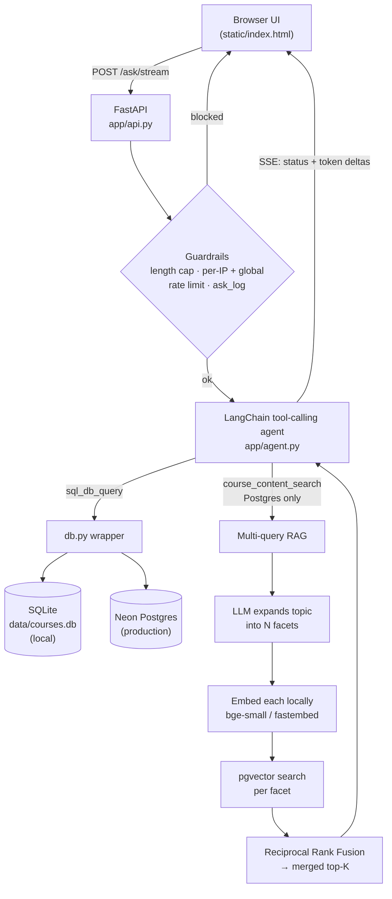

# UIUC Course Explorer Data Agent

**Ask plain-English questions about UIUC's course catalog and get answers backed by real SQL — not a guess.**

A full pipeline built on top of UIUC's public [Course Explorer](https://courses.illinois.edu/cisdocs/explorer)
API: a concurrent, resumable scraper feeds a documented schema; a FastAPI
backend serves it; and a hybrid LangChain agent turns questions into
executable SQL (or semantic search over course descriptions) and streams the
answer back token-by-token. Runs on SQLite locally and Neon Postgres in
production from the same code.

> Built as a work sample. It walks the whole arc of dataset work — pull from
> an external source, structure it, expose it through an API, and let someone
> query it in plain language — and then keeps going into the parts that
> usually get skipped: retrieval quality, guardrails, feedback loops, and a
> measured eval of the agent itself.

---

## Highlights

### The agent

- **Hybrid retrieval in one agent.** A LangChain tool-calling agent with two
  tools — direct SQL and semantic search over course descriptions — that
  chooses per question. The whole schema (and the term coverage, and the
  house rules) lives in the prompt, so a typical answer is **~2 model calls,
  not a round-trip to introspect the database first**.
- **Multi-query retrieval + Reciprocal Rank Fusion.** A vague question is
  expanded by a cheap LLM call into several distinct facets; each is
  embedded and searched separately in pgvector; the ranked lists are fused —
  `score(course) += 1 / (k + rank)` — into one de-duplicated set. Wider
  recall than a single embedding, and enough material for a real thematic
  summary instead of a flat dump. Every knob is an env var.
- **Streams, with memory.** Answers arrive over Server-Sent Events with live
  `Running SQL…` / `Searching course descriptions…` status labels, then type
  themselves out; a ~2 KB client-side Markdown renderer formats them. The
  server is stateless — it re-trims the last few turns to resolve "it" /
  "that course" / "the second one".
- **Every answer is sourced.** A deterministic footer names the datasets a
  fact came from and how fresh they are — *"Sources: UIUC Course Explorer
  (CS synced 2026-08-25); grade distributions (wadefagen/datasets)."* — built
  by parsing the SQL the agent actually ran, no extra model call. Refusals
  get none.
- **Prerequisites and the academic calendar are queryable.** Prereqs are
  parsed out of the free-text description into AND-ed groups of alternatives
  (`GET …/prereqs` also returns what a course *unlocks*); the registrar's
  per-term calendar — add/drop/withdraw deadlines, breaks, finals — is a
  table the agent can answer "last day to drop this fall" from.

### Measured, not assumed

- **An eval harness for the agent itself.** 24 questions with known-correct
  SQL; four metrics (execution success, result-match accuracy, hallucinated-
  reference rate, repair success rate); an opt-in **Generator → Critic →
  Repair** loop (LangGraph) scored with the loop off vs. on. The Critic pairs
  a deterministic `sqlglot` schema check with an LLM intent check; a bad
  query is repaired twice, then fails explicitly rather than answering wrong.
  The first run's result was *not* the expected one — and it's written up
  that way. [`evals/FINDINGS.md`](evals/FINDINGS.md)
- **Guardrails that hold under abuse.** A length cap, per-IP hourly/daily
  limits, and a **global daily cap that keys on nothing the client
  controls** — the actual budget backstop. Every attempt logged with outcome
  and latency; only calls that spent a model call count against the limit.
- **Feedback that closes.** 👍/👎 per answer (downvotes snapshot the whole
  exchange into a review queue), a site-wide free-text box, and an
  `ADMIN_TOKEN`-gated dashboard with unique-client counts, a per-day activity
  chart, a client rollup, and the raw question log.
- **Security-reviewed.** CSP + the standard header set on every response, an
  optional `SELECT`-only DB role for the agent's SQL tool (a jailbreak still
  can't run DDL/DML), prompt-injection resistance in the system prompt,
  docs/OpenAPI off by default, and a documented red-team pass
  ([`security_findings.md`](security_findings.md)).

### The plumbing

- **One query text, two databases.** `app/db.py` makes the same
  `?`-placeholder SQL run on SQLite (local) and Postgres (prod): placeholder
  translation, a single `upsert()` covering both `INSERT OR REPLACE` and
  `ON CONFLICT`, unified schema introspection. Nobody needs Postgres to
  develop.
- **Self-hosted embeddings, zero API dependency.** `BAAI/bge-small-en-v1.5`
  (384-dim, ~130 MB) via `fastembed`'s ONNX runtime — no key, no rate limit,
  baked into the container at build time. The vectors are always comparable
  because the exact same model runs everywhere.
- **Provider-agnostic LLM.** Auto-detects Groq → Gemini → OpenAI from
  whichever key is set, or pin one with `LLM_PROVIDER`. Swapping providers is
  an env var, not a code change.
- **Resumable, concurrent scraper.** A full-catalog scrape fetches courses in
  parallel; rows upsert on their natural key; `Ctrl+C` is safe and the run
  picks up where it left off.

---

## Architecture



Two storage layers: the **relational catalog** (`sections`, `meetings`,
`grade_distributions`, `teachers_ranked_excellent`, `gen_ed_categories`) and
a Postgres-only **`course_embeddings`** vector table for semantic search. The
server is stateless — the browser holds the transcript and sends a short
window of prior turns back with each question for back-reference resolution.

Deep dives: [`docs/PROJECT_BIBLE.html`](docs/PROJECT_BIBLE.html) (orientation),
[`docs/architecture.html`](docs/architecture.html) (illustrated storage model
+ request path + RAG loop), [`DECISIONS.md`](DECISIONS.md) (why every choice
was made, including the rejected alternatives).

---

## Quickstart

```bash
python3 -m venv .venv
source .venv/bin/activate          # Windows: .venv\Scripts\activate
pip install -r requirements.txt
```

### 1. Scrape

```bash
# A few departments, fast (no instructor/enrollment) — quick sanity check
python app/scraper.py --year 2026 --semester fall --subjects CS,STAT,IS --fast

# Full detail (instructor + live enrollment status), every subject that term.
# Courses are fetched concurrently (10 workers), which is what makes a
# full-catalog scrape practical rather than an all-nighter.
python app/scraper.py --year 2026 --semester fall
```

Writes `data/courses.db`. Re-running is safe — rows upsert on
`(year, semester, subject, course_number, crn)` — and `Ctrl+C` is safe too:
what's scraped is committed, and the run resumes.

| flag | effect |
|---|---|
| `--fast` | skip per-section instructor/enrollment requests |
| `--concurrency N` | courses fetched in parallel per subject (default 10) |
| `--skip-recent HOURS` | skip courses already scraped within the window |
| `--section-delay SECONDS` | pause between per-section requests (detailed mode, default 0.1) |

Then the derived / external tables (each is a no-op if its input is missing,
and re-runnable):

```bash
python -m app.load_grades          # wadefagen grade distributions
python -m app.load_geneds          # wadefagen gen-ed categories
python -m app.load_tre             # wadefagen "ranked excellent" instructors
python -m app.load_prereqs         # parse Prerequisite: clauses out of descriptions
python -m app.load_calendar --term 2026-fall \
    --url https://registrar.illinois.edu/fall-2026-academic-calendar/
```

### 2. Serve

```bash
uvicorn app.api:app --reload
```

Open `http://127.0.0.1:8000/` — browse and filter sections, or ask the
assistant, all from the browser. Needs one LLM key in the environment
(`GROQ_API_KEY` recommended — free tier; `GEMINI_API_KEY` / `OPENAI_API_KEY`
also work).

### 3. Ask

```bash
python app/agent.py "Which CS courses have the most sections this fall?"
```

```bash
curl -sX POST http://127.0.0.1:8000/ask \
  -H 'Content-Type: application/json' \
  -d '{"question": "Who teaches CS 233 this fall, and where does it meet?"}'
```

---

## The assistant, in depth

### Hybrid SQL + semantic search

The agent is a LangChain `tool-calling` SQL agent with the full schema and
the house rules (lowercase terms, uppercase subject codes, `LIMIT` unless
it's an aggregate, course-vs-section semantics, which terms the data
actually covers) written into its system prompt. It's told **not** to call
`sql_db_schema` / `sql_db_list_tables` / `sql_db_query_checker` — it already
knows the schema — so a well-formed answer is ~2 iterations, not 6.

For open-ended "what courses cover X" questions it reaches for
`course_content_search` instead of guessing at `description LIKE '%…%'`.

### Multi-query expansion + RRF

`course_content_search` doesn't embed the raw question. First a cheap LLM
call rewrites it into the cleaned topic plus a few distinct facets
(`RAG_SUBQUERIES`, default 3). Each facet is embedded **locally** and
searched in pgvector (`RAG_K_PER`, default 6). The per-facet ranked lists
are combined with Reciprocal Rank Fusion —

```
score(course) += 1 / (k + rank)     # k = 60
```

— keeping the best cosine distance seen per course for display, and the
top `RAG_K_RETURN` (default 10) go to the synthesis step. Tunable entirely
by env var; set `RAG_MULTIQUERY=0` to fall back to single-query.

### Streaming + conversation

`POST /ask/stream` emits SSE frames: `status` (a friendly progress label per
tool), `token` (answer deltas as the model writes them), and one
authoritative `done`. LLM calls made *inside* a tool (the RAG expansion) are
never streamed to the client. The browser keeps the transcript; the server
re-trims the last few turns server-side and uses them only to resolve
"it" / "that course" / "the second one".

---

## Reliability & safety

### `/ask` guardrails

| control | default | keyed on |
|---|---|---|
| question length cap | 500 chars | — |
| per-IP rate limit | 10/hour, 60/day | `X-Forwarded-For` (friction only) |
| **global daily cap** | 250/day | nothing client-controlled — the real budget backstop |

Only calls that actually spend a model call count against the limits; a
provider outage never locks users out. Every attempt lands in `ask_log`
with outcome (`answered` / `refused` / `error` / …) and latency, all
surfaced on the admin dashboard.

### Feedback loops

- **👍/👎 per answer** — downvotes snapshot the whole exchange into a
  `reviewed=0` triage queue for a biweekly quality pass.
- **Site-wide feedback box** — free text from the footer, its own table and
  review panel, per-IP daily cap.
- **Admin dashboard** (`ADMIN_TOKEN`-gated) — unique clients (24 h / 7 d /
  all-time), question volume, outcome breakdown, a per-day activity chart, a
  per-client rollup, and the raw question log.

### Evals

`app/sql_pipeline/` is a second, opt-in answer path — an explicit
**Generator → Critic → Repair** loop wired with LangGraph. The Critic runs a
deterministic `sqlglot` check that every table and column in a generated
query really exists, plus an LLM check that the query matches the question's
intent; a failed query is repaired (twice, then an explicit "I'm not
confident" rather than a wrong answer). Off by default —
`SQL_PIPELINE=critic` routes `ask()` through it.

`evals/` measures whether it helps: 24 questions with known-correct SQL,
four metrics (execution success, result-match accuracy, hallucinated-
reference rate, repair success rate), loop **off vs. on**, same model.

The first run's finding was not the expected one: with the full schema in
the prompt and a capable model, the base agent hallucinates column
references **0%** of the time, so the deterministic check has nothing to
catch — and the *LLM* intent-check, used as a first-pass gate, made accuracy
*worse* by inventing objections to correct queries. That analysis
([`evals/FINDINGS.md`](evals/FINDINGS.md)) drove a fix (the intent-check is
now a repair *verifier*, never a first-pass veto; plus a cycle-breaker and
"keep the first query that ran"), after which the loop is a no-op where the
generator is already good and a real win where it isn't (terse-schema
ablation: hallucinated-reference rate 31 % → 6 %, execution success
69 % → 100 %).

```bash
python -m evals.run --provider openai -y      # full run (needs a key)
python -m evals.test_static_check             # offline, no LLM
python -m evals.test_graph_routing            # offline, no LLM
python -m evals.test_prereqs                  # offline — prereq parser
python -m evals.test_calendar                 # offline — calendar parser
python -m evals.test_citations                # offline — source footer
```

Full tables and methodology: [`evals/RESULTS.md`](evals/RESULTS.md),
[`evals/README.md`](evals/README.md).

### Security

CSP + `X-Content-Type-Options` / `X-Frame-Options` / `Referrer-Policy` /
HSTS on every response. The agent's SQL tool uses `DATABASE_URL_RO` (a
`SELECT`-only Postgres role) when set, so a prompt-injection that gets past
the system prompt still can't run DDL/DML. Interactive docs and the OpenAPI
schema are off unless `ENABLE_DOCS` is set. `security_findings.md` records a
red-team pass and the hardening that followed.

---

## Data model

Seven relational tables (plus a Postgres-only `course_embeddings` vector
table). One row per **section** in `sections`; a **course** is
`(subject, course_number)` — aggregate across its sections unless a specific
CRN is asked about.

| table | grain | notes |
|---|---|---|
| `sections` | one section per term | instructor, `enrollment_status`, `credit_hours`, `description` (per-course, nullable), term dates |
| `meetings` | one meeting per section | days, start/end time, building, room — a section can have several (lecture + discussion) |
| `grade_distributions` | one per (term, sched type, instructor) | letter-grade counts + withdrawals; a rolling window of terms, not full history |
| `teachers_ranked_excellent` | one per ranked instructor | "ranked as excellent by their students"; `unit` is a department name, not a subject code |
| `gen_ed_categories` | one per course | which gen-ed categories a course satisfies (point-in-time snapshot) |
| `prerequisites` | one per (course, requirement-group, option) | parsed from the description, best-effort: `group_index` buckets AND-ed groups, rows in a group are alternatives, `raw_text` is always kept |
| `academic_calendar` | one per (term, event) | registrar dates — instruction / add / drop / withdraw / break / holiday / finals / grades / registration / commencement, loaded per term |

Sources: the live UIUC Course Explorer XML (`sections`, `meetings`,
descriptions, gen-ed attributes), `wadefagen/datasets` CSVs
(`grade_distributions`, `gen_ed_categories`, `teachers_ranked_excellent`),
the UIUC registrar (`academic_calendar`), and the description text itself
(`prerequisites`). `scraped_at` on `sections` records when each row was last
written; `/freshness` reports staleness per `(subject, year, semester)`.

---

## API surface

| group | endpoints |
|---|---|
| **Browse** | `GET /subjects` · `GET /courses/{subject}` · `GET /sections` (filter by subject, course, instructor, term, level) · `GET /stats` · `GET /freshness` |
| **Assistant** | `POST /ask` · `POST /ask/stream` (SSE — what the UI uses) · `POST /ask/feedback` · `GET /ask/summary` |
| **Tools** | `POST /schedule/conflicts` (day/time overlap over a set of CRNs) · `GET /courses/{subject}/{course_number}/grade-trend` (per-term distribution + computed average GPA) · `GET /courses/{subject}/{course_number}/prereqs` (parsed requirement groups + what the course unlocks) · `GET /calendar` (registrar dates, filter by `year`/`semester`/`category`) |
| **Demand** | `GET /sync/status` · `POST /sync/request` (register interest in refreshing a department) |
| **Feedback** | `POST /feedback` (free text) |
| **Admin** (`ADMIN_TOKEN`) | `GET /admin/ask-log` · `/admin/ask-stats` · `/admin/clients` · `/admin/activity` · `/admin/feedback` · `/admin/site-feedback` (+ `…/{id}/reviewed`) |

---

## Deployment

Render (web service) + Neon (Postgres, external — Render's free Postgres
expires after 30 days). The build step also pre-downloads the embedding
model into `model_cache/` so it's on disk before the first request. Full
runbook — env vars, the read-only role, the local-SQLite → Neon migration,
the monthly refresh flow — in [`DEPLOYMENT.md`](DEPLOYMENT.md).

---

## Known limitations

- **Cross-listed courses** (CS 440 / ECE 448) are stored as separate rows
  under each subject, as Course Explorer lists them. Not yet deduplicated.
- **`enrollment_status` is a snapshot**, not live — re-scrape to refresh.
  Answers that depend on it carry a "reflects the last sync" note.
- **No intra-run diffing** — a course is fully re-fetched unless
  `--skip-recent` skips it entirely; there's no "only refresh enrollment"
  path.
- **`grade_distributions` / `teachers_ranked_excellent` can be empty** for a
  term the upstream datasets haven't published yet — a correct answer says
  so plainly rather than inventing data.
- **Scraping runs locally, by hand** — there is no scheduled re-scrape; the
  deployed app serves whatever the last sync loaded (by design, see
  `DECISIONS.md`).

---

## Repo layout

```
course-explorer-agent/
├── app/
│   ├── scraper.py        # concurrent, resumable CISAPI scraper → SQLite
│   ├── api.py            # FastAPI backend (browse, assistant, admin, tools)
│   ├── agent.py          # hybrid NL→SQL + RAG agent, provider auto-detect
│   ├── db.py             # one query text, two backends (SQLite / Postgres)
│   ├── embeddings.py     # self-hosted bge-small vectors, pgvector storage
│   ├── ask_log.py        # /ask guardrails + activity log
│   ├── feedback.py       # 👍/👎 + downvote review queue
│   ├── site_feedback.py  # free-text feedback box
│   ├── sql_pipeline/     # opt-in Generator → Critic → Repair loop (LangGraph)
│   ├── prereqs.py        # parse Prerequisite: clauses from description text
│   ├── citations.py      # deterministic "Sources: …" answer footer
│   └── load_*.py         # grade / gen-ed / TRE / catalog / prereq / calendar loaders
├── evals/                # 24-question eval set + harness + findings
├── static/index.html     # web UI (served at /)
├── docs/                 # PROJECT_BIBLE.html + illustrated architecture.html
├── DECISIONS.md          # running log of every real decision + rejected options
├── DEPLOYMENT.md         # Render + Neon runbook
└── security_findings.md  # red-team pass + hardening
```
