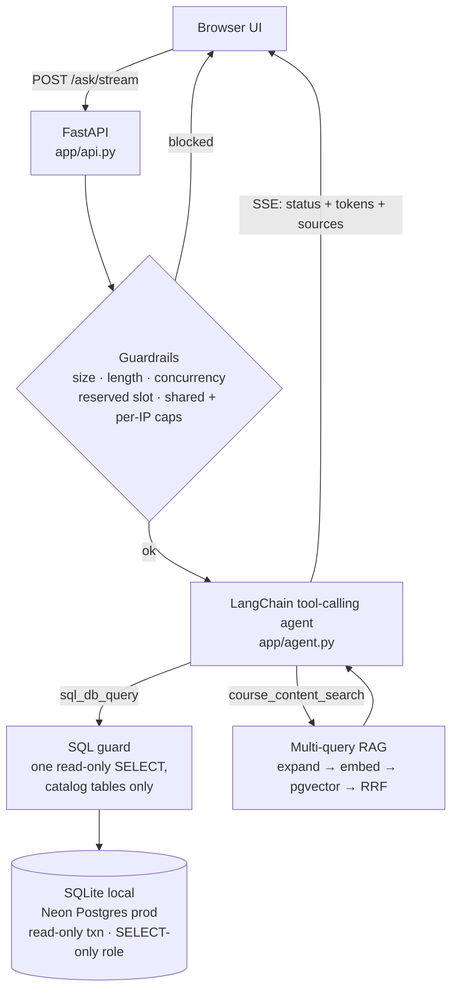

# Illini Course Copilot

**Ask plain-English questions about UIUC's course catalog and get answers backed by real SQL, not a guess.**

*Not affiliated with, endorsed by, or sponsored by the University of Illinois.*

I built a text-to-SQL agent over UIUC's public
[Course Explorer](https://courses.illinois.edu/cisdocs/explorer) data, put it
behind a FastAPI backend, and then did the part most demos skip: measured
whether the agent's own safety net (a Critic/Repair loop) actually helped.
It mostly didn't, and that turned out to be the most useful thing in the
project. Then I measured the prompt itself, and rewriting it moved answer
quality from 62% to 90%. See [What I learned](#what-i-learned).

Stack: Python · FastAPI · LangChain / LangGraph · SQLite + Neon Postgres +
pgvector · self-hosted embeddings · sqlglot · Server-Sent Events · Render.

---

## What it does

- **Answers from real data.** A tool-calling agent picks per question between
  direct SQL and semantic search over course descriptions. The full schema and
  live notes about the data sit in the prompt, so a typical answer is one query
  plus the answer, with no database-introspection round trip first.
- **Can only read.** Every query the model writes is parsed and allowlisted,
  runs in a read-only transaction with a timeout, and connects as a
  SELECT-only database role. The prompt is one safety layer, not the only one.
- **Cites its sources.** Each answer ends with a footer naming the datasets it
  used and how fresh they are, built by parsing the SQL the agent actually ran
  (no extra model call).
- **Streams, with memory.** Answers arrive token by token over SSE with live
  status labels ("Running SQL…"). The chat survives moving between pages; the
  server is stateless and uses the last few turns only so "that course"
  resolves.
- **Wider than chat.** Prerequisites (parsed from free text), the academic
  calendar, grade trends, a schedule builder with conflict checks, and
  "No 8ams / Done by 5 / No Fridays" filters that never touch the LLM.

## What I learned

Six things that happened in this project, not things I read about.

1. **A safety net can be a no-op, or a net negative.** With the full schema in
   the prompt, the base agent invented a column 0% of the time, so the Critic's
   schema check never fired. Its LLM "intent check" made things worse: it
   invented objections to correct queries and "repaired" them into wrong ones
   (result-match 92.3% → 84.6% on the first run). I demoted it to a repair
   verifier that can no longer veto a first-pass query.
2. **Test where the failure actually lives.** Where the loop had nothing to
   fix, I made the generator worse on purpose (terse schema, smaller model).
   There the loop earned its place: invented references 31% → 6%, execution
   success 69% → 100%.
3. **The prompt is code, so measure it.** Reviewing the system prompt against
   what the framework actually sends turned up a hidden pre-filled turn that
   contradicted my own instructions, a time format that made "classes after
   10 AM" silently undercount (263 instead of 334), and refusals worded so
   inconsistently that my own logging couldn't recognize them. The rewrite
   took answer-OK from 62.1% to 89.7% on 29 questions against the live
   database, and I ran the old prompt twice first, because single runs moved
   by up to 18 points.
4. **Rate limits are a design input.** The free Groq tier allows 8,000
   tokens/min, and the daily cap is per model. I added a global daily cap that
   keys on nothing the client controls, reserved each question's slot before
   the model runs so a burst can't slip past the cap, and started budgeting
   eval runs like money. Because the cap is per model, a second model on the
   same key is a failover with its own budget.
5. **"Works locally" is not "works in prod."** One SQL string had to run on
   SQLite and Postgres. A `%` inside a `LIKE` broke only on psycopg2, the two
   databases store times differently, and a scraper "wall" only showed up
   against the live site.
6. **Log the why.** Every non-obvious choice, including the options I rejected,
   is in [`DECISIONS_v2.md`](DECISIONS_v2.md). It saved me from re-arguing
   things.

## Evals

29 questions with known-correct SQL: in-scope, hallucination-bait, empty-data
and out-of-scope refusals. Gold answers are the gold SQL executed live in the
same run.

**The system prompt, before and after** (the live agent against the
production database, `gpt-4o-mini`; old prompt averaged over two runs)

| metric | old prompt | rewritten prompt |
|---|---|---|
| answer-OK | 62.1% | **89.7%** |
| result match, loose / strict | 73.5% / 50.0% | **94.1% / 64.7%** |
| out-of-scope refusals recognized | 0% | **100%** |
| no-data handled | 81.3% | **87.5%** |

**The Critic/Repair loop, full schema in the prompt (what production uses)**

| model | questions | answer-OK | hallucinated references |
|---|---|---|---|
| `gpt-oss-120b` | 11 (subset) | 91% | 0% |
| `qwen3.8-27b` | 12 (same subset) | 92% | 0% |
| `gpt-oss-20b` | 12 (same subset) | 67% | 0% |
| `gpt-oss-20b` | all 29 | 79% baseline, 83% with loop | 0% |

**Terse schema (table names only), a stress test for the loop**

| model | questions | hallucinated refs, base → loop | execution success | answer-OK |
|---|---|---|---|---|
| `qwen3.8-27b` | 12 | 29% → **0%** | 83% → **100%** | 67% → **83%** |
| `gpt-4o-mini` | 24 | 31% → **6%** | 69% → **100%** | n/a |

**What it says.** With the full schema the loop never fired on any model: no
invented columns, zero repairs, so it changes nothing. It earns its place when
the generator is handicapped, which is the case that matters if the prompt is
trimmed for cost or a smaller model is swapped in. The prompt itself was the
bigger lever.

**Caveats, stated up front.** The loop comparisons are single runs; the
12-question subset is biased toward questions earlier runs got wrong, so use
it to compare models, not as a headline number. The prompt comparison ran on
`gpt-4o-mini` to keep Groq's shared daily budget for real users; it was
confirmed on the production model with targeted questions, not a full repeat.
Latency isn't reported because rate-limit back-off swamps it. Methodology:
[`evals/RESULTS.md`](evals/RESULTS.md), [`evals/FINDINGS.md`](evals/FINDINGS.md),
[`DECISIONS_v2.md`](DECISIONS_v2.md) §7.

## Architecture


```mermaid
flowchart TD
    UI["Browser UI"] -->|POST /ask/stream| API["FastAPI<br/>app/api.py"]
    API --> GUARD{"Guardrails<br/>size · length · concurrency<br/>reserved slot · shared + per-IP caps"}
    GUARD -->|blocked| UI
    GUARD -->|ok| AGENT["LangChain tool-calling agent<br/>app/agent.py"]
    AGENT -->|sql_db_query| SQLG["SQL guard<br/>one read-only SELECT,<br/>catalog tables only"]
    SQLG --> DB[("SQLite local<br/>Neon Postgres prod<br/>read-only txn · SELECT-only role")]
    AGENT -->|course_content_search| RAG["Multi-query RAG<br/>expand → embed → pgvector → RRF"]
    RAG --> AGENT
    AGENT -->|SSE: status + tokens + sources| UI
```

The server is stateless. Storage: the relational catalog (sections, meetings,
grade distributions, gen-eds, prerequisites, calendar), a Postgres-only vector
table for semantic search, and the app's own log and feedback tables, which
the assistant can never query. Opt-in: `SQL_PIPELINE=critic` routes `ask()`
through the Generator → Critic → Repair loop in `app/sql_pipeline/`.

## Engineering choices worth a look

| choice | why |
|---|---|
| One query text, two databases (`app/db.py`) | Nobody needs Postgres to develop; placeholders and upserts are translated |
| Model SQL parsed with `sqlglot`, read-only transaction, SELECT-only role | Three independent layers; a jailbreak can't write or read other users' data |
| Live "data notes" appended to the prompt | Terms, unpublished registration and empty tables come from the data, so nothing drifts after a scrape |
| Self-hosted embeddings (`bge-small` via fastembed) | No API key, no rate limit, same vectors everywhere |
| Provider-agnostic LLM (Groq → OpenAI → Gemini) | Swapping providers is an env var, not a code change |
| Failover to a second Groq model on a 429 | Daily caps are per model, so the backup has its own budget; one retry, no loops |
| Multi-query expansion + Reciprocal Rank Fusion | Wider recall than one embedding; enough material for a real summary |
| Reserved rate-limit slots, global daily cap, concurrency ceiling | Budget backstop that holds under parallel requests; findings in [`security_findings.md`](security_findings.md) |
| Strict CSP (`script-src 'self'`), hash-pinned dependencies | No inline scripts anywhere; builds only change when the lock does |

## Run it

```bash
python -m venv .venv && source .venv/bin/activate   # Windows: .venv\Scripts\activate
pip install -r requirements.txt                     # hash-pinned lock (Python 3.14)
python -m app.scraper --year 2026 --semester fall --subjects CS,STAT --fast
uvicorn app.api:app --reload                        # http://127.0.0.1:8000
```

Run scripts as modules from the project root (`python -m app.…`). The
assistant needs one LLM key (`GROQ_API_KEY`, `OPENAI_API_KEY` or
`GEMINI_API_KEY`). Offline tests, no key needed, for example
`python -m evals.test_sql_guard` and `python -m evals.test_request_guards`;
all ten suites are listed in [`docs/REFERENCE_v2.md`](docs/REFERENCE_v2.md).

## Known limitations

- The free host sleeps when idle, so the first visit after a quiet spell is a
  cold start, and Groq's free per-minute token limit makes busy moments slow.
- Fall 2026 is synced for 84 of 191 subjects so far; scraping runs by hand from
  a residential IP, and the deployed app serves whatever was last loaded.
- Grade and instructor-ranking data are empty until the upstream datasets
  publish recent terms; the agent says so instead of inventing data.
- Enrollment status is a snapshot from the last sync, not live, and for fall
  2026 only a scheduling code.
- Cross-listed courses (CS 440 / ECE 448) are separate rows, not deduplicated.
- The eval set is small (29 questions); treat percentages as directional.

## More

- [`docs/REFERENCE_v2.md`](docs/REFERENCE_v2.md): full reference (commands, API, configuration, data model, repo layout)
- [`DECISIONS_v2.md`](DECISIONS_v2.md): every decision in force and the alternatives I rejected
- [`implementation_plan_v2.md`](implementation_plan_v2.md): what's left to do
- [`DEPLOYMENT_v2.md`](DEPLOYMENT_v2.md): Render + Neon runbook
- [`docs/architecture_v2.html`](docs/architecture_v2.html) · [`docs/PROJECT_BIBLE_v2.html`](docs/PROJECT_BIBLE_v2.html): illustrated data flow and the project handbook
- [`security_findings.md`](security_findings.md): red-team findings and hardening
