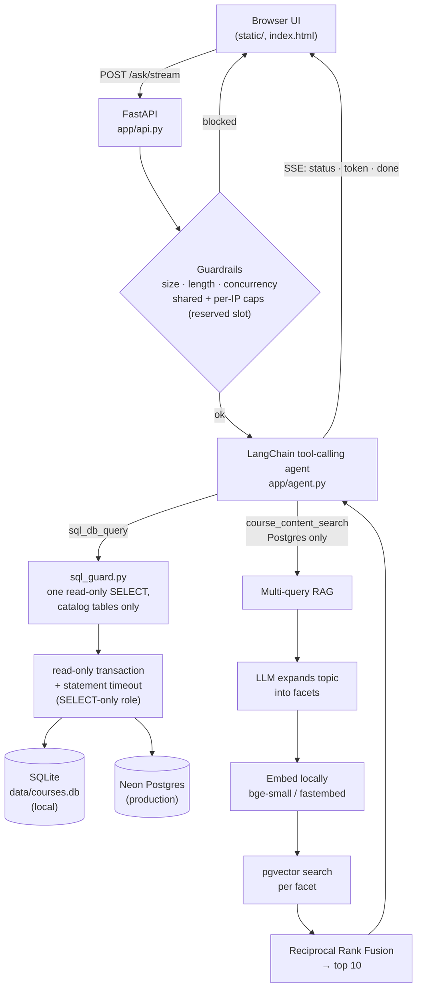

> Full reference (v2), written from the code as of 2026-09-24. The short
> version is [`../README.md`](../README.md). Links below are relative to
> this `docs/` folder.

# Illini Course Copilot

**Ask plain-English questions about UIUC's course catalog and get answers
backed by real SQL, not a guess.**

*Not affiliated with, endorsed by, or sponsored by the University of
Illinois.*

A full pipeline on top of UIUC's public
[Course Explorer](https://courses.illinois.edu/cisdocs/explorer) data: a
concurrent, resumable scraper feeds a documented schema; a FastAPI backend
serves it; and a hybrid LangChain agent turns questions into executable SQL
(or semantic search over course descriptions) and streams the answer back
token by token. The same code runs on SQLite locally and Neon Postgres in
production.

---

## Highlights

### The agent

- **Hybrid retrieval in one agent.** A LangChain tool-calling agent with two
  tools, direct SQL and semantic search over course descriptions, chooses per
  question. The whole schema, the house rules and live notes about the data
  are in the prompt, so a typical answer is one query plus the answer, with no
  schema discovery.
- **Multi-query retrieval + Reciprocal Rank Fusion.** A vague topic is
  expanded by one cheap LLM call into several facets; each is embedded locally
  and searched in pgvector; the ranked lists are fused with
  `score += 1 / (60 + rank)`.
- **Streams, with memory.** Answers arrive over Server-Sent Events with live
  "Running SQL…" status lines. The chat survives page changes in the tab
  (`sessionStorage`); the server stays stateless and uses the last 3 turns only
  to resolve "it" or "the second one".
- **Every answer is sourced.** A deterministic footer names the datasets the
  executed SQL touched and when each subject was last synced, with no extra
  model call.
- **Measured prompt.** The system prompt was rewritten and evaluated on the
  live database: answer-OK 62.1% → 89.7% on 29 questions
  ([`../DECISIONS_v2.md`](../DECISIONS_v2.md) §7).

### Safety

- **Model-written SQL can only read, and only the catalog.** Three independent
  layers: the prompt; a `sqlglot` guard that allows one read-only query over
  the seven catalog tables and runs it in a read-only transaction with an 8 s
  timeout; and a SELECT-only database role.
- **Guardrails that hold under abuse.** Length cap, per-IP limits, a shared
  daily cap keyed on nothing the client controls, reserved slots so parallel
  requests can't slip past the cap, a concurrency ceiling, feedback caps and a
  request size limit.
- **Strict CSP** (`script-src 'self'`, no inline scripts anywhere), header-only
  admin token, no internal error text in responses, hash-pinned audited
  dependencies.

### The plumbing

- **One query text, two databases.** `app/db.py` runs the same `?`-placeholder
  SQL on SQLite and Postgres.
- **Self-hosted embeddings.** `BAAI/bge-small-en-v1.5` (384 dimensions) via
  `fastembed`'s ONNX runtime: no key, no rate limit, baked into the build.
- **Provider-agnostic LLM.** Groq → OpenAI → Gemini, by whichever key is set,
  with a one-time 429 failover to a second Groq model.

---

## Architecture



Three kinds of storage in one database: the **catalog** (`sections`,
`meetings`, `grade_distributions`, `teachers_ranked_excellent`,
`gen_ed_categories`, `prerequisites`, `academic_calendar`), the Postgres-only
**`course_embeddings`** vector table, and the app's own tables (`ask_log`,
`answer_feedback`, `site_feedback`, `sync_requests`), which the assistant can
never query.

Deep dives: [`PROJECT_BIBLE_v2.html`](PROJECT_BIBLE_v2.html) (the handbook),
[`architecture_v2.html`](architecture_v2.html) (illustrated data flow),
[`../DECISIONS_v2.md`](../DECISIONS_v2.md) (why, by topic).

---

## Quickstart

```bash
python -m venv .venv
source .venv/bin/activate          # Windows: .venv\Scripts\activate
pip install -r requirements.txt    # hash-pinned lock, built for Python 3.14
```

Run every command from the project root as a module (`python -m app.…`), so
the `app` package imports resolve. Each script loads `.env` itself.

### 1. Get data

```bash
# A few departments, fast (no instructor/enrollment) - a quick sanity check
python -m app.scraper --year 2026 --semester fall --subjects CS,STAT,IS --fast

# Full detail (instructor + enrollment status) for every subject that term
python -m app.scraper --year 2026 --semester fall
```

Writes to Neon when `DATABASE_URL` is set, otherwise to `data/courses.db`.
Re-running is safe: rows upsert on `(year, semester, subject, course_number,
crn)`, and `Ctrl+C` keeps what's already saved. It must run from a
residential IP; UIUC's firewall rejects datacenter ranges and soft-blocks long
sweeps.

| flag | effect |
|---|---|
| `--year`, `--semester` | the term (required) |
| `--subjects CS,STAT` | only these subjects (default: every subject) |
| `--fast` | skip per-section instructor/enrollment requests |
| `--concurrency N` | courses fetched in parallel (default 10) |
| `--skip-recent HOURS` | skip courses scraped within the window |
| `--section-delay SECONDS` | pause between per-section requests (default 0.1) |

Refresh departments on demand (what visitors ask for with **Sync**):

```bash
python -m app.sync_requests --list            # departments ranked by demand
python -m app.sync_requests --run CS MATH     # refresh these
python -m app.sync_requests --run --top 5     # refresh the 5 most requested
```

The other tables (each re-runnable):

```bash
python -m app.load_grades          # wadefagen grade distributions (term window)
python -m app.load_geneds          # wadefagen gen-ed categories
python -m app.load_tre             # wadefagen "ranked excellent" instructors
python -m app.load_prereqs         # parse Prerequisite: clauses from descriptions
python -m app.load_calendar --term 2026-fall \
    --url https://registrar.illinois.edu/fall-2026-academic-calendar/
python -m app.backfill_embeddings  # fill course_embeddings (--force, --limit N)
```

### 2. Serve

```bash
uvicorn app.api:app --reload
```

Open `http://127.0.0.1:8000/`. The assistant needs one LLM key: `GROQ_API_KEY`
(recommended, free tier), or `OPENAI_API_KEY` / `GEMINI_API_KEY`, tried in
that order.

### 3. Ask

```bash
python -m app.agent "Which CS courses have the most sections this fall?"

curl -sX POST http://127.0.0.1:8000/ask \
  -H 'Content-Type: application/json' \
  -d '{"question": "Who teaches CS 233 this fall, and where does it meet?"}'
```

---

## The assistant, in depth

### Hybrid SQL + semantic search

The agent (`create_sql_agent`, tool-calling) has the full schema and the house
rules in `SYSTEM_CONTEXT`. It's told not to call `sql_db_list_tables`,
`sql_db_schema` or `sql_db_query_checker`, and LangChain's default pre-filled
"I should look at the tables" turn is replaced with one that agrees. For
open-ended "what courses cover X" questions it uses `course_content_search`.
Limits: `max_iterations=6`; a single tool result is cut at 6,000 characters
(`MAX_QUERY_RESULT_CHARS`) with a note telling the model to narrow the query.

### The prompt's live DATA NOTES

Appended at startup from the data itself: the current year, the terms present
(newest first), which terms only have `A`/`P` scheduling codes (open/closed
isn't published there), and which tables are empty. Nothing is hardcoded that
would drift after a scrape.

### Multi-query expansion + RRF

`course_content_search` first asks the LLM (non-streaming) to rewrite the
topic and add `RAG_SUBQUERIES` (default 3) facets; each is embedded locally
and searched `RAG_K_PER` (default 6) deep; the lists are fused with Reciprocal
Rank Fusion (`k = 60`), keeping the best distance per course; the top
`RAG_K_RETURN` (default 10) are returned. `RAG_MULTIQUERY=0` disables the
expansion.

### Streaming and conversation

`POST /ask/stream` emits SSE frames: `status`, `token`, one final `done`, or
`error`. LLM calls made inside a tool are never streamed. The browser keeps up
to 10 turns in `sessionStorage` and sends the last 3; the server re-trims them
(question 200 chars, answer 250).

### Providers and failover

`GROQ_MODEL` (default `openai/gpt-oss-120b`), `OPENAI_MODEL` (`gpt-4o-mini`),
`GEMINI_MODEL` (`gemini-2.5-flash`); `LLM_PROVIDER` forces one. On a Groq 429
the question is retried once on `GROQ_FALLBACK_MODEL` (default
`qwen/qwen3.8-27b`; `off` disables), before any answer text is streamed.

### Citations

Every answered response ends with a footer such as *"Sources: UIUC Course
Explorer (CS synced 2026-08-25)."*, built by parsing the SQL the agent ran.
`ANSWER_CITATIONS=0` turns it off.

---

## Reliability & safety

### `/ask` guardrails

| control | default (env var) | notes |
|---|---|---|
| request body | 256 KB (`MAX_BODY_BYTES`) | 413 above it |
| question length | 500 chars (`ASK_MAX_CHARS`) | 422 |
| concurrent questions | 4 (`ASK_MAX_CONCURRENT`; 2 on Render) | immediate 503 "busy" |
| **shared daily cap** | 250/day (`ASK_GLOBAL_PER_DAY`) | keys on nothing client-controlled |
| per-IP limit | 10/hour, 60/day (`ASK_RATE_PER_HOUR`, `ASK_RATE_PER_DAY`) | spoofable `X-Forwarded-For`: friction only |

Each question reserves a `pending` row in `ask_log` before the model runs, and
the caps count rows in reservation order, so parallel requests can't all pass
on one count. Only `answered`, `refused` and `pending` count, so a provider
outage never locks users out. Every attempt is logged with its outcome
(`answered`, `refused`, `rate_limited`, `global_limited`, `too_long`, `error`,
`pending`) and latency.

### SQL safety

`app/sql_guard.py` parses every model-written statement and refuses anything
but one read-only query over the seven catalog tables: no writes or DDL
anywhere in the tree (including inside CTEs), no `SELECT INTO`, no
`FOR UPDATE`, no `ask_log` / feedback tables, no `pg_catalog`, no functions
like `pg_sleep` or `set_config`. It runs in a `READ ONLY` transaction with an
8 s timeout (`SQL_STATEMENT_TIMEOUT_MS`). In production it connects as a
SELECT-only role (`DATABASE_URL_RO`); on Render the assistant refuses to
answer if that role isn't configured.

### Feedback loops

- **👍/👎 per answer.** Downvotes snapshot the exchange into a review queue;
  50 new votes per IP and 2,000 in total per day.
- **Site feedback box.** Free text, 2,000 characters, 5 per IP per day.
- **Admin dashboard** (`/admin.html`, token-gated): unique clients, volume,
  outcomes, a per-day chart, a per-client rollup, the question log and both
  review queues.

### Evals

`evals/run.py` scores the assistant on 29 questions with known-correct SQL
(executed live, not frozen). Arms: `prod` (the live agent), `baseline` and
`critic` (the opt-in Generator → Critic → Repair pipeline, `SQL_PIPELINE`).
Use `--db env` to evaluate against Neon, and `--provider openai` for full runs
so Groq's shared daily budget stays with users.

```bash
python -m evals.run --arms prod --db env --provider openai -y
python -m evals.run --arms prod --db env --provider groq --ids q01,q27,q29 -y
python -m evals.run --rescore <TIMESTAMP> --db env     # re-score, no LLM calls
```

Offline tests (no LLM, no network):

```bash
python -m evals.test_sql_guard         # SQL guard + read-only paths
python -m evals.test_request_guards    # caps, concurrency, bounds, body size, CSP
python -m evals.test_agent_guards      # iteration cap, provider order, truncation
python -m evals.test_static_check      # critic's schema check
python -m evals.test_graph_routing     # pipeline routing
python -m evals.test_llm_failover      # Groq 429 failover
python -m evals.test_citations         # source footer
python -m evals.test_prereqs           # prerequisite parser
python -m evals.test_calendar          # calendar parser
python -m evals.test_schedule_filters  # No 8ams / Done by 5 / No Fridays
```

### Security

Every response carries a CSP (`script-src 'self'`, styles from self and Google
Fonts, `frame-ancestors 'none'`), `X-Frame-Options: DENY`, `nosniff`,
`Referrer-Policy: no-referrer` and HSTS. HTML, CSS and JS are sent with
`Cache-Control: no-cache`. `/docs` and `/openapi.json` are off unless
`ENABLE_DOCS` is set. Admin routes take `ADMIN_TOKEN` in the `X-Admin-Token`
header only. Red-team passes: [`../security_findings.md`](../security_findings.md).

---

## Data model

| table | grain | notes |
|---|---|---|
| `sections` | one section (CRN) per term | instructor, `enrollment_status` (a word, or an `A`/`P` code for an unpublished term), `credit_hours`, `description` (per course), part-of-term dates, `scraped_at` |
| `meetings` | one meeting block per section | days (`MTWRFSU`, R = Thursday), start/end time as text (`09:00AM` / `09:00 AM` / `ARRANGED`), building, room |
| `grade_distributions` | term × course × schedule type × instructor | letter-grade counts, W, students; term window only (**empty now**: upstream lag) |
| `teachers_ranked_excellent` | ranked instructor × term | department *name*, bare course number (**empty now**) |
| `gen_ed_categories` | course | category codes (`hum` = `HP`/`LA`, `qr` = `QR1`/`QR2`, ...); one snapshot |
| `prerequisites` | course × requirement group × option | parsed from descriptions; groups are AND-ed, rows in a group are alternatives; `raw_text` kept |
| `academic_calendar` | term × event | registrar dates by category (instruction, add, drop, withdraw, break, holiday, finals, grades, registration, commencement, other) |
| `course_embeddings` | course (Postgres only) | 384-dim vector of the description, HNSW cosine index |
| `ask_log` · `answer_feedback` · `site_feedback` · `sync_requests` | app bookkeeping | never visible to the assistant |

Production on 2026-09-24: 19,848 sections (191 subjects; 84 with fall 2026
data), 20,476 meetings, 1,060 gen-ed rows, 5,838 prerequisite rows, 79
calendar events, 5,464 embeddings; grades and rankings 0.

---

## API surface

| group | endpoints |
|---|---|
| **Browse** | `GET /subjects` · `GET /courses/{subject}` · `GET /sections` (subject, course number, instructor, year, semester, level, `starts_after`, `ends_before`, `no_days`, `limit`) · `GET /stats` · `GET /freshness` · `GET /meetings` (up to 50 CRNs) · `GET /calendar` |
| **Course detail** | `GET /courses/{subject}/{course_number}/grade-trend` · `GET /courses/{subject}/{course_number}/prereqs` |
| **Schedule** | `POST /schedule/conflicts` (2-50 CRNs, one term) |
| **Assistant** | `POST /ask` · `POST /ask/stream` (SSE) · `POST /ask/feedback` · `GET /ask/summary` · `GET /ask/trending` |
| **Demand** | `GET /sync/status` · `POST /sync/request` |
| **Feedback** | `POST /feedback` |
| **Admin** (`X-Admin-Token`) | `GET /admin/ask-log` · `/admin/ask-stats` · `/admin/clients` · `/admin/activity` · `/admin/feedback` · `/admin/site-feedback` · `POST …/{id}/reviewed` |
| **Info** | `GET /api` |

---

## Configuration

| variable | default | purpose |
|---|---|---|
| `DATABASE_URL` | unset → SQLite | Neon connection string; switches the backend |
| `DATABASE_URL_RO` | required on Render | SELECT-only role for model-written SQL |
| `ALLOW_RW_AGENT_DB` | unset | temporary override of the requirement above |
| `GROQ_API_KEY` · `OPENAI_API_KEY` · `GEMINI_API_KEY` | — | LLM provider, tried in that order |
| `LLM_PROVIDER` | auto | force `groq` / `openai` / `gemini` |
| `GROQ_MODEL` · `OPENAI_MODEL` · `GEMINI_MODEL` | `openai/gpt-oss-120b` · `gpt-4o-mini` · `gemini-2.5-flash` | model per provider |
| `GROQ_FALLBACK_MODEL` | `qwen/qwen3.8-27b` | retried once on a Groq 429; `off` disables |
| `ADMIN_TOKEN` | unset (admin always 403) | admin dashboard and routes |
| `ENABLE_DOCS` | unset | exposes `/docs`, `/redoc`, `/openapi.json` |
| `ASK_MAX_CHARS` · `ASK_RATE_PER_HOUR` · `ASK_RATE_PER_DAY` · `ASK_GLOBAL_PER_DAY` | 500 · 10 · 60 · 250 | question guardrails |
| `ASK_MAX_CONCURRENT` | 4 (2 on Render) | concurrent questions |
| `MAX_BODY_BYTES` | 262144 | request size limit |
| `ANSWER_FEEDBACK_PER_IP_DAY` · `ANSWER_FEEDBACK_GLOBAL_DAY` | 50 · 2000 | 👍/👎 caps |
| `SITE_FEEDBACK_MAX_CHARS` · `SITE_FEEDBACK_PER_IP_DAY` | 2000 · 5 | feedback box caps |
| `SQL_STATEMENT_TIMEOUT_MS` | 8000 | per-statement timeout for model SQL |
| `MAX_QUERY_RESULT_CHARS` | 6000 | tool result cut-off |
| `RAG_MULTIQUERY` · `RAG_SUBQUERIES` · `RAG_K_PER` · `RAG_K_RETURN` | on · 3 · 6 · 10 | semantic search |
| `ANSWER_CITATIONS` | on | source footer |
| `SQL_PIPELINE` · `SQL_PIPELINE_INTENT_CHECK` · `SQL_PIPELINE_TERSE_SCHEMA` | off · `repair` · off | opt-in Critic/Repair pipeline |

---

## Deployment

Render free web service + Neon free Postgres. The build installs the
hash-pinned `requirements.txt` (Python 3.14) and pre-downloads the embedding
model into `model_cache/`. Deploys are manual (Render dashboard → Manual
Deploy → Deploy latest commit). Runbook, including the SELECT-only role
recipe: [`../DEPLOYMENT_v2.md`](../DEPLOYMENT_v2.md).

---

## Known limitations

- **Cold starts.** The free instance sleeps when idle; the first visit after
  that waits for Render plus about 2 s of app startup (open plan item).
- **Answer speed on Groq's free tier.** Per-minute token limits make
  multi-step questions and simultaneous users slow.
- **Grades and instructor rankings are empty** until the upstream datasets
  publish terms inside the window; the assistant says so.
- **Fall 2026 coverage is partial**: 84 of 191 subjects synced so far.
- **`enrollment_status` is a snapshot**, and for fall 2026 only a scheduling
  code; there are no seat counts.
- **Cross-listed courses** (CS 440 / ECE 448) are separate rows per subject.
- **Scraping is manual and local**, by design.

---

## Repo layout

```
course-explorer-agent/
├── app/
│   ├── api.py               # FastAPI: routes, guardrails, headers, body limit
│   ├── agent.py             # hybrid SQL + RAG agent, SYSTEM_CONTEXT, streaming
│   ├── sql_guard.py         # parse-and-allowlist check for model SQL, read-only engine
│   ├── db.py                # one query text, two backends; read-only connections
│   ├── embeddings.py        # bge-small vectors, pgvector table and search
│   ├── citations.py         # "Sources: …" footer from the executed SQL
│   ├── ask_log.py           # question log, reservations, rate limits, admin stats
│   ├── feedback.py          # 👍/👎 + review queue
│   ├── site_feedback.py     # free-text feedback box
│   ├── sync_requests.py     # department refresh demand + operator CLI
│   ├── scraper.py           # concurrent, resumable Course Explorer scraper
│   ├── prereqs.py           # Prerequisite: clause parser
│   ├── terms.py             # the rolling term window
│   ├── load_*.py            # grades, TRE, gen-eds, prereqs, calendar, catalog snapshot
│   ├── backfill_embeddings.py · migrate_sqlite_to_neon.py · clean_descriptions.py
│   └── sql_pipeline/        # opt-in Generator → Critic → Repair (LangGraph)
├── static/                  # 8 pages + one script file per page + shared modules
├── evals/                   # 29-question eval set, harness, offline tests
├── docs/                    # handbook, architecture, this reference
├── .claude/agents/          # qa, redteam, code-critic, startup-critic, improvement-strategist
├── README.md                # short portfolio README
├── DECISIONS_v2.md          # decisions in force, by topic
├── implementation_plan_v2.md # what's left to do
├── DEPLOYMENT_v2.md         # Render + Neon runbook
├── security_findings.md     # red-team passes
├── requirements.in          # direct dependencies (edit this)
└── requirements.txt         # hash-pinned lock (Python 3.14)
```
